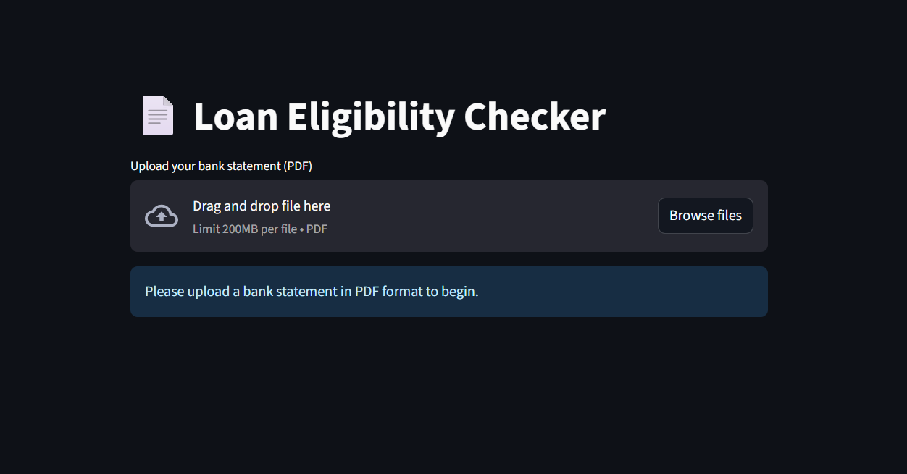
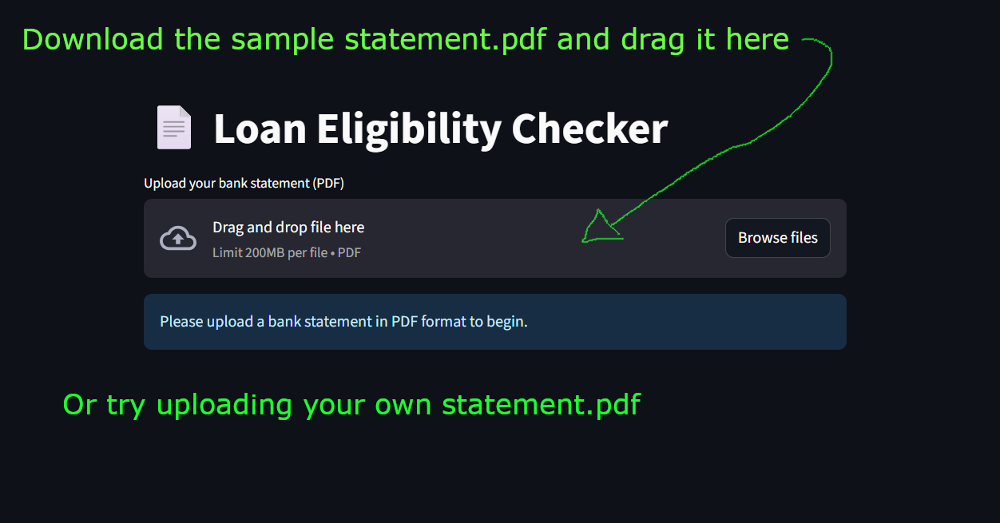
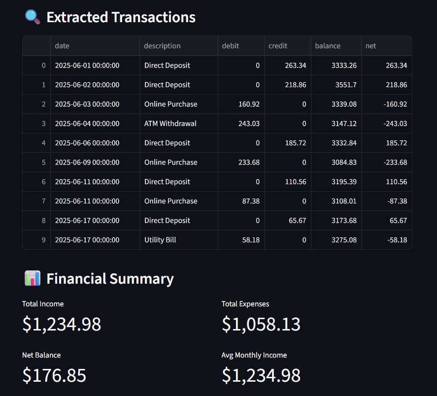
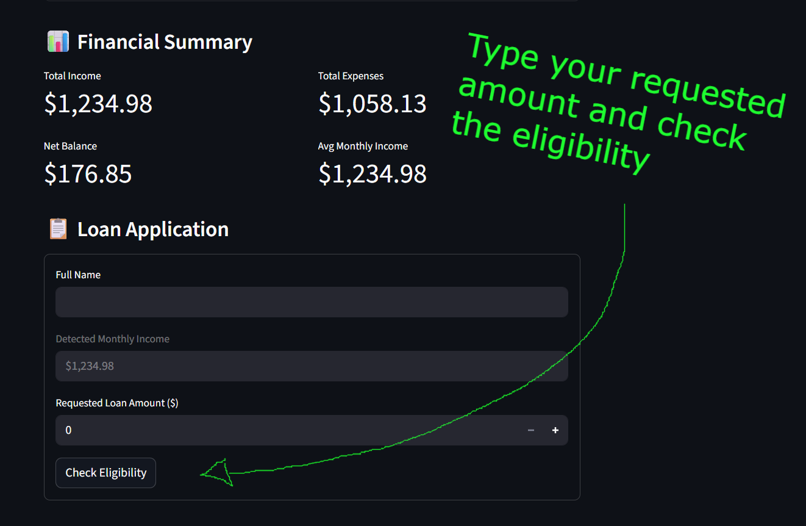
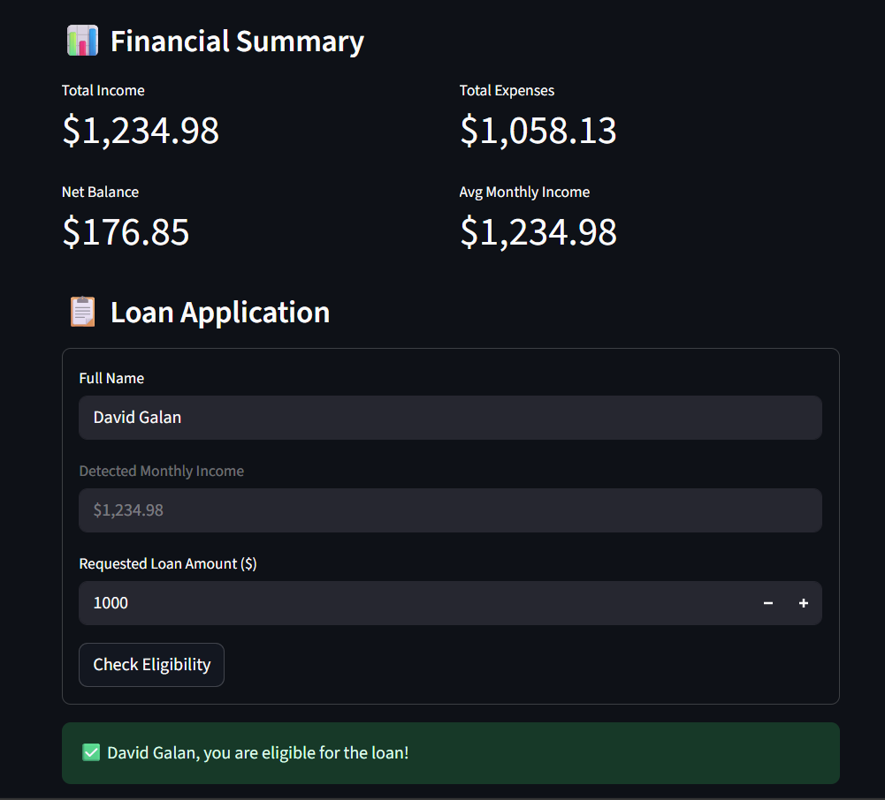

# 💼 Loan Eligibility Checker App

A web app that extracts bank transactions from PDF statements and determines loan eligibility based on financial history.

---

## 🚀 Features

- 📤 Upload a bank statement (PDF)
- 🔍 Extracts transactions using `pdfplumber`
- 📊 Calculates total income, expenses, average monthly income
- ✅ Checks basic loan eligibility
- 🌐 Web-based — no installation required

---

## 📂 How to Use

1. 👉 [**Launch the App**](https://loan-eligibility-app-mi9k768vr9qhnumrhbfgs4.streamlit.app) or visit: [https://loan-eligibility-app-mi9k768vr9qhnumrhbfgs4.streamlit.app](https://loan-eligibility-app-mi9k768vr9qhnumrhbfgs4.streamlit.app)  
    
   

2. Click **"Browse files"** to upload your PDF statement  
   📥 Or download a sample:  
   [Click here to download the sample bank statement](https://github.com/Davidthewhitewizard/loan-eligibility-app/raw/main/sample_data/sample_bank_statement.pdf)  
    
   

3. Review your financial summary  
    
   

    
    

4. Fill in the loan application form  
    
   

    

5. See if you're eligible!  
    
   

---

## 🔧 Tech Stack

- 🐍 Python
- 🎈 Streamlit
- 📄 PDFPlumber
- 🧮 Pandas
- ☁️ GitHub + Streamlit Cloud

---

## 🤝 Author

**David The Wizard** 🧙‍♂️  
🔗 [GitHub](https://github.com/Davidthewhitewizard)

